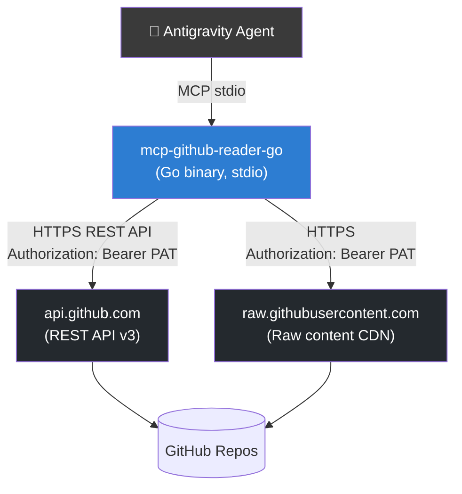

# mcp-github-reader-go — Design Document

## Overview

A new Go MCP server that gives agents the ability to read content from GitHub repositories using a Personal Access Token
(PAT). The server follows the established Antigravity Kit pattern: `mark3labs/mcp-go` → stdio transport → binary
registered in `mcp_config.json`.

---

## System Diagram



---

## Key Data Models / Contracts

### Environment Variables

| Variable         | Required | Description                                           |
| ---------------- | -------- | ----------------------------------------------------- |
| `GITHUB_TOKEN`   | ✅ Yes   | Personal Access Token (classic or fine-grained)       |
| `GITHUB_API_URL` | No       | Override base URL (default: `https://api.github.com`) |

### MCP Tools

| Tool Name             | Description                        | Key Params                                           |
| --------------------- | ---------------------------------- | ---------------------------------------------------- |
| `get_file_content`    | Read file content from a repo path | `owner`, `repo`, `path`, `ref` (optional)            |
| `list_directory`      | List files/dirs at a given path    | `owner`, `repo`, `path` (optional), `ref` (optional) |
| `get_repository_info` | Fetch repo metadata                | `owner`, `repo`                                      |
| `search_code`         | Search code within a specific repo | `owner`, `repo`, `query`, `per_page` (optional)      |

### Rate Limit Headers (tracked internally)

```
X-RateLimit-Limit
X-RateLimit-Remaining
X-RateLimit-Reset
```

The server logs rate limit status to **stderr** (never stdout to preserve MCP protocol integrity).

---

## File Structure

```
tools/
└── mcp-github-reader-go/
    ├── DESIGN.md                  ← This file
    ├── go.mod                     ← Module: antigravity-kit/mcp-github-reader-go
    ├── go.sum
    ├── main.go                    ← MCP server entrypoint + tool registration
    └── mcp-github-reader-go       ← Compiled binary (gitignored)
```

### Module Dependencies

```go
require (
    github.com/mark3labs/mcp-go v0.45.0   // MCP protocol
    github.com/google/go-github/v62        // GitHub REST API v3 client
    golang.org/x/oauth2                    // Bearer token transport
)
```

Note: `github.com/google/go-github/v62` is the canonical Go GitHub client. It handles pagination, ETag caching, and
rate-limit-aware retries natively.

---

## Proposed Implementation per Tool

### `get_file_content`

Uses `GET /repos/{owner}/{repo}/contents/{path}?ref={ref}`.

- For text files: decodes Base64 content and returns UTF-8 string.
- For binary files: returns a message indicating the file is binary + the SHA.
- If `ref` is empty, defaults to the repo's default branch.

### `list_directory`

Uses `GET /repos/{owner}/{repo}/contents/{path}?ref={ref}`.

- Returns a Markdown-formatted tree with file type (📄/📁), name, and SHA.
- Limits output to 200 entries for safety.

### `get_repository_info`

Uses `GET /repos/{owner}/{repo}`.

- Returns: full name, description, default branch, language, stars, forks, visibility, last updated.

### `search_code`

Uses `GET /search/code?q={query}+repo:{owner}/{repo}`.

- Returns: file path, HTML URL, and first matching line fragment (text: field).
- Capped at `per_page` (default 10, max 30) to avoid large payloads.

---

## Error Handling Strategy

| Condition              | Behavior                                                  |
| ---------------------- | --------------------------------------------------------- |
| `GITHUB_TOKEN` not set | Return descriptive error immediately; do NOT call API     |
| 401 Unauthorized       | Return actionable error: "Invalid token or token expired" |
| 404 Not Found          | Return "File/Repo not found at {path}"                    |
| 403 Rate Limited       | Return remaining count + reset time from headers          |
| Binary file            | Return info message; never crash                          |

---

## Risk & Dependency Analysis

| Risk                                  | Mitigation                                                                   |
| ------------------------------------- | ---------------------------------------------------------------------------- |
| stdout pollution → corrupt MCP stream | All logs go to `fmt.Fprintf(os.Stderr, ...)`                                 |
| Rate limit exhaustion                 | Log `X-RateLimit-Remaining` on every request to stderr                       |
| Large binary files in base64          | Detect `content == ""` + `encoding == "base64"` and return truncated message |
| Private repos                         | PAT with `repo` scope works; fine-grained PAT needs `Contents: Read`         |
