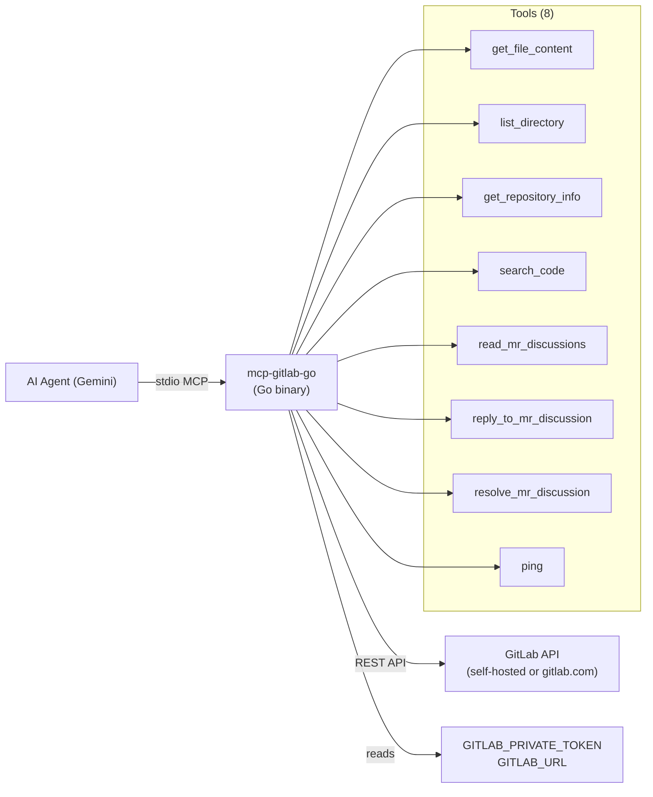

# Design: mcp-gitlab-go (Unified GitLab MCP Tool)

**Task ID**: `gitlab-unified-mcp` **Date**: 2026-03-16 **Replaces**: `mcp-gitlab-mr-discussions-go` + planned
`mcp-gitlab-reader-go`

---

## 1. Overview

`mcp-gitlab-go` consolidates all GitLab interactions into a **single MCP server binary**:

- **Repository reading** (files, directories, metadata, code search)
- **Merge Request discussions** (read, reply, resolve)

This eliminates the proliferation of one-purpose tools and mirrors how `mcp-github-reader-go` is a single server for all
GitHub operations.

---

## 2. System Diagram



---

## 3. Tools Exposed

| Tool                     | Origin       | Description                                                            |
| ------------------------ | ------------ | ---------------------------------------------------------------------- |
| `get_file_content`       | New (reader) | Read raw text of a file, base64-decoded, paginated                     |
| `list_directory`         | New (reader) | List files/dirs at a path, Markdown tree, ≤200 entries                 |
| `get_repository_info`    | New (reader) | Repo metadata (name, stars, branch, visibility)                        |
| `search_code`            | New (reader) | Search code blobs within a project                                     |
| `read_mr_discussions`    | Migrated     | All discussion threads on an MR                                        |
| `reply_to_mr_discussion` | Migrated     | Reply to a discussion thread                                           |
| `resolve_mr_discussion`  | Migrated     | Resolve/unresolve a discussion thread                                  |
| `ping`                   | New          | Health-check: `{"status":"ok","server":"McpGitLab","version":"1.0.0"}` |

---

## 4. Key Data Contracts

### Environment Variables

| Variable               | Required | Default              | Description                               |
| ---------------------- | -------- | -------------------- | ----------------------------------------- |
| `GITLAB_PRIVATE_TOKEN` | ✅       | —                    | GitLab PAT with `read_api` + `api` scopes |
| `GITLAB_URL`           | ❌       | `https://gitlab.com` | Base URL for self-hosted instances        |

### GitLab API Notes

- **File content**: `GET /projects/:id/repository/files/:file_path?ref=` → `content` field is **base64-encoded**
- **Directory listing**: `GET /projects/:id/repository/tree?path=&ref=&per_page=100` (auto-paginated internally)
- **Repo info**: `GET /projects/:id`
- **Code search**: `GET /projects/:id/search?scope=blobs&search=<query>`
- **MR discussions**: All existing calls from `mcp-gitlab-mr-discussions-go`

### Parameter: `project_id`

GitLab accepts either a **numeric ID** (`12345`) or a **URL-encoded namespace path** (`mygroup%2Fmyrepo`). The Go client
handles URL-encoding internally when the string contains `/`.

---

## 5. File Structure

```
tools/
├── mcp-gitlab-go/              ← NEW (unified)
│   ├── main.go                 ← All 8 tools + client factory + main()
│   ├── go.mod                  ← module: antigravity-kit/mcp-gitlab-go
│   ├── go.sum                  ← generated
│   └── DESIGN.md               ← copy of this file
└── mcp-gitlab-mr-discussions-go/   ← TO BE DELETED after T3 passes
```

---

## 6. Architecture Decisions

| Decision                                    | Rationale                                                                             |
| ------------------------------------------- | ------------------------------------------------------------------------------------- |
| Single binary, single `main.go`             | Consistent with all other tools in the kit                                            |
| Reuse `gitlab.com/gitlab-org/api/client-go` | Already proven in `mcp-gitlab-mr-discussions-go`                                      |
| `project_id` for all tools                  | GitLab's primary identifier — supports both numeric IDs and `namespace/project` paths |
| Rune-based pagination on `get_file_content` | Handles multi-byte UTF-8 safely (identical to github-reader)                          |
| Delete old `mcp-gitlab-mr-discussions-go`   | Avoids confusion; new tool is a superset                                              |

---

## 7. Migration Impact

| Item                          | Change                                                          |
| ----------------------------- | --------------------------------------------------------------- |
| `GEMINI.md` line 31           | `@mcp:gitlab-mr-discussions/` → `@mcp:gitlab/` with all 7 tools |
| `README.md` tools table       | Replace old entry with `mcp-gitlab-go`                          |
| `mcp_config.json` (if exists) | Would need binary path updated — **check with user**            |
| Old design file               | `design/design-gitlab-reader-mcp.md` → superseded by this file  |

---

## 8. Risk Analysis

| Risk                                     | Mitigation                                            |
| ---------------------------------------- | ----------------------------------------------------- |
| Deleting old tool breaks mcp_config      | Confirm no `mcp_config.json` found in project root    |
| Binary file passed to `get_file_content` | Null-byte detection before returning content          |
| MR discussions missing `mr_iid` as int   | Cast `float64` → `int64` safely, same as current code |

---

## 9. Verification Commands

| Step            | Command                                                                                     |
| --------------- | ------------------------------------------------------------------------------------------- |
| Build           | `cd tools/mcp-gitlab-go && go mod tidy && go build -o mcp-gitlab-go .`                      |
| Vet             | `cd tools/mcp-gitlab-go && go vet ./...`                                                    |
| Smoke-test ping | `echo '{"method":"tools/call","params":{"name":"ping","arguments":{}}}' \| ./mcp-gitlab-go` |
